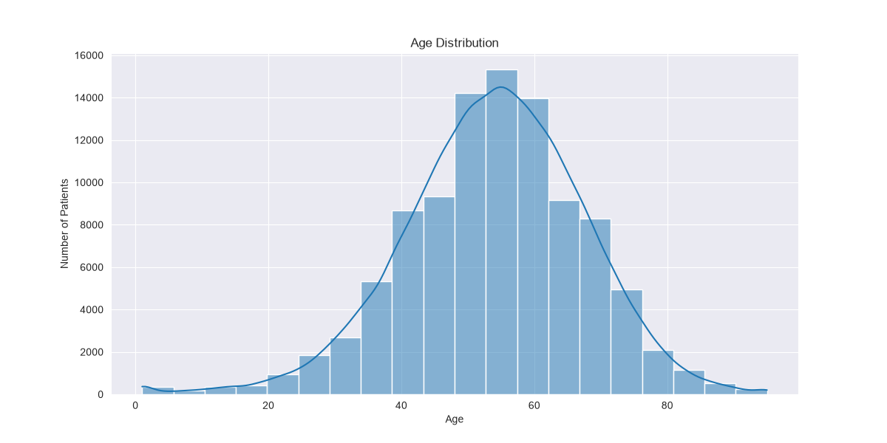
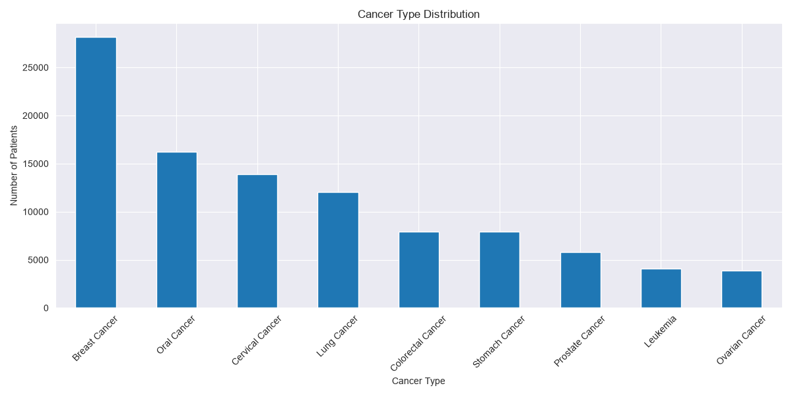
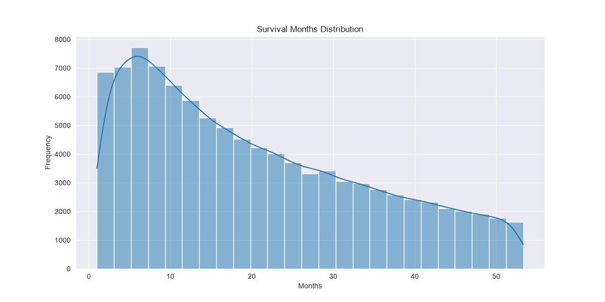
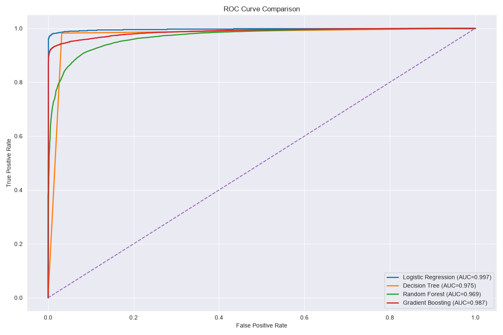

# Cancer Outcome Prediction

Exploratory Data Analysis (EDA) + data visualization + feature engineering + machine learning classification modeling

This project uses the **Indian Cancer Patient Dataset (2022–2025)**, which was sourced from Kaggle.

## 🧠 Project Overview

This project explores and analyzes cancer patient data from India collected between 2022 and 2025. The objective is to identify patterns within the data and build machine learning models capable of predicting a patient's survival status based on demographic, clinical, and treatment-related features.

The project follows a complete data science workflow, including:

- Exploratory Data Analysis (EDA)
- Data visualization
- Feature engineering and preprocessing pipelines
- Machine learning model training
- Model evaluation and comparison

## 📊 Dataset

The dataset contains the following columns:

| Feature | Description |
|--------|-------------|
| Patient_ID | Patient identifier |
| Age | Patient age |
| Gender | Patient gender |
| Cancer_Type | Type of cancer |
| Stage | Cancer stage |
| Treatment_Type | Treatment method |
| Diagnosis_Date | Converted into Year/Month/Day features |
| Survival_Months | The number of months from diagnosis until death or last follow-up. |
| Hosptial_Name | Treated at Hospital |
| Status | Dead or alive |

### Target Variable

| Variable | Description |
|----------|-------------|
| Status | Patient survival outcome (Alive / Deceased) |

### Dropped Variables
|----------|-------------|
| Patient_ID | Adds extra info |
| Diagnosis_Date | Was split up into YY/MM/DD |
| Hospital_Name | Adds extra info |

- Note: Some columns such as `Patient_ID` and `Hospital_Name` were removed during feature engineering as they do not contribute to prediction. The `Diagnosis_Date` is excluded but was split into year, month, and days.

## 🤖 Machine Learning Models

The following classification models were trained and evaluated:

- Logistic Regression
- Decision Tree
- Random Forest
- Gradient Boosting

## 📈 Evaluation Metrics

Each model was evaluated using:

- Accuracy
- Precision
- Recall
- F1 Score
- ROC AUC

## 📁 Project Structure

```
Cancer-Outcome-Prediction/
├── data/        # Dataset files
├── images/      # Visualizations and plots
├── notebooks/   # Jupyter notebooks (EDA + modeling)
├── src/         # Python modules for preprocessing and ML pipeline
└── README.md
```

## 🛠️ Technologies Used

- Python
- Pandas
- NumPy
- Matplotlib
- Scikit-learn
- Jupyter Notebook

## 📊 Data Visualizations

### Age Distribution


### Cancer Type Distribution


### Survival Month Distribution


## 📈 Model Performance

### ROC Curve Comparison

